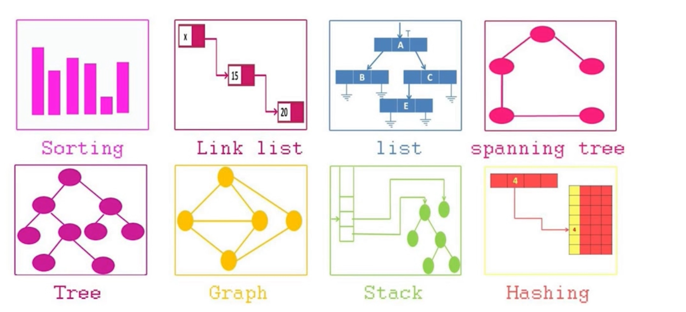
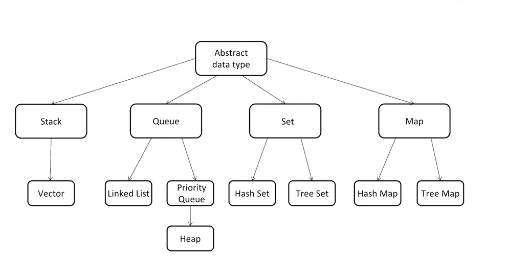

# GeekTimeAlgorithmQinChao
极客时间 覃超 算法课程

## 第二节：如何学好算法与数据结构

### 精通一个领域
1. Chunk it up 切碎知识点
2. Deliberate praticing 刻意练习
3. Feedback 反馈

#### chunk it up 切碎知识点

#### deliberate practicing 刻意练习
1. 刻意练习
2. 练习缺陷，弱点地方
3. 感觉不舒服，不爽，

#### Feedback 反馈
> 反馈及时，主动看高手代码，看Github或Leetcode代码， 也可以被高手指点，例如code review

### 切题4件套
1. 分类
2. 可能性的解决方案: 1. 比较时间/空间复杂度 2. optimal(加强)
3. 多写 coding
4. 多测试

**做题不要想到第一个解法就开始动手，而是多比较几个解法然后选择最佳的解法开始解决**

